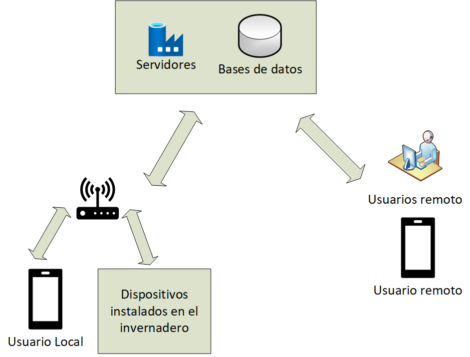

# Ejercicio CiberKillChain - Ataque

## Alumno

Fabian Dario Caihuara Sossa

## Enunciado

Armar una cyberkillchain usando técnicas de la matriz de Att&ck para un escenario relacionado al trabajo práctico de la carrera.

## Datos trabajo práctico

[Proyecto Final de CEIOT](https://drive.google.com/file/d/1FjbXYzCWZ4eS5C56Qv2SLjFVFD-HcaBf/view?usp=sharing)

El trabajo práctico tiene como principal objetivo unir tecnologıas IoT (Internet of Things) con
el cultivo hortícola en huertos urbanos, que con el tiempo se están volviendo mas comunes en
terrazas y balcones.

Las razones de esta nueva moda urbana son diversas. El creciente uso de productos quımicos
en los cultivos tradicionales, ası como el crecimiento del mercado de productos transg ́enicos son
un motivo de reflexión que está incrementando la venta de productos ecológicos en la sociedad.

Se desarrollar ́a una solucion capaz de brindar el servicio a invernaderos de distintos clientes,
ofreciendo una herramienta centralizada, donde se pueda consultar las distintas metricas
definidas por el usuario.

Se desarrollara la solucion en entornos propios usando tecnolog ́ıas de software libre, la conexión
de los dispositivos será de manera inalámbrica (Wi-Fi).

Los datos recolectados por los sensores son enviados al servidor, ante eventuales cortes de
comunicación debe existir un mecanismo de retención de la informacion, la comunicación cliente-
servidor se lleva a cabo a través del protocolo MQTT.

En la figura 1 se presenta el diagrama en bloques del sistema. Se observa que el módulo
Wi-Fi se comunica y envia datos al servidor, ya sea de variables y/o estado de actuadores
conectados al equipo. Una base de datos administrar ́a la información de todos los equipos
conectados al servidor, se debera ademas visualizar el estado actual en un tablero, enviar alertas
y notificaciones y gestionar la información mediante una API, para permitir al usuario descargar
los datos en algún formato definido como csv, xlsx, pdf, etc.

## Resolución

### Ciber Kill Chain :

#### Reconnaissance

La solucion en analisis, corresponde a un servicio que provee por una parte el hardware (sensores y actuadores) que tiene comunicacion con una API, 
en la nube para registro de telemetria de los sensores y control remoto del cultivo, los usuarios finales pueden o no tener conocimientos de medidas
de ciberseguridad, que puedan ayudar a mantener seguro el funcionamiento y la veracidad de los datos y acciones recolectados por sensores y actuadores

  - Active Scanning (T1595): La solucion al estar implementada sobre redes WIFI domesticas, permitiria ejecutar escaneos de reconocimiento activos para recopilar informacion de los paquetes nativos de red que se transmiten. 
  - Gather Victim Host Information (T1592): Se puede realizar un analisis de informacion de la red domestica del usuario final, con la finalidad de identificar que la solucion tiene conectado un dispositivo Raspberry PI, y los servicios que estan corriendo sobre la plataforma, detectar los sensores y actuadores que se conectan mediante el microcontrolador ESP32-C3
  - Phishing for information (T1598): Al ser usuarios finales con o sin conocimientos sobre phishing para obtener informacion confidencial como ser usuario y contraseña a la web de monitoreo, donde el usuario tiene control y configuracion de parametros de sus cultivos remotos.

#### Weaponization
##### Hardware
  - Vulnerabilidades ESP32 C3: Ataque de fallas de voltaje (CVE-2019-17391), 
  - Vulnerabilidades Raspberry PI: Ataque de access point en RPi (CVE-2020-24572), Elevacion de privilegios mediante un proceso de debug (CVE-2018-18068)
##### Software
  - Identificar cuenta de los servicios de monitoreo y control remoto de cultivos de usuarios mediante Phishing, para obtener informacion personal de los usuarios de medios de pagos, llegara a poder escalar de manera horizontal y llegar a tener privilegios de administracion.
  
#### Delivery
  - Ingreso a cuentas de usuarios y manipular inforamción personal y controlar parametros de confirguarcion de los cultivos
  - Ingreso remoto mediante la red WiFi domestica de algun usuario 
  
#### Exploit
  - Basandose en la vulnerabilidad de ataque de access point RPi obtener acceso a los dispositivos y poder instalar algun exploit en la Raspberry PI.
  - A partir de acceso de usuarios de la plataforma, elevar los privilegios del ambiente del dominio modificando la política vigente.
  - Basandose en la vulnerabilidad con acceso remoto, aplicar Ataque de fallas de voltaje para dañar la telemetria de los sensores.
  
#### Installation  
  - Manipulación de cuenta. Sin afectar el acceso de la víctima, el atacante accede y modifica roles y permisos de la cuenta para habilitar el movimiento lateral o tener mayores privilegios para llegar a su objetivo. (T1098)
  - Persistir servicios remotos y control de escritorio remoto de Raspberry PI de la red.

#### Command & Control
  - Si la manipulacion de las cuentas fue exitosa y no fue detectada los ingresos por algun log de la aplicacion por parte de los usuarios se puede avanzar con el escalamiento de privilegios para poder obtener informacion personal del ususario y de otros usuarios como medios de pago por el servicio de monitoreo.
  - Si la persistencia de acceso remoto y control es exitosa, se controlar el trafico de red y realizar un escalamiento horizontal y registrar o llegara a controlar otros sistemas o equipos conectados a la red domestica.
  
#### Actions on Objectives
  - Realizar daños a los cultivos para desprestigiar el servicio ofrecido por la plataforma.
  - Desplazamiento horizontal para tener acceso a otros sistemas domesticos de camaras y domotica del domicilio.
  - Daño en los dispositivos de hardware (sensores, actuadores y controladores).
  - Denegacion de servicio.
  - Secuestro de recursos.
  - Extraccion de informacion personal y de tarjetas de pago de servicio.
  

  

